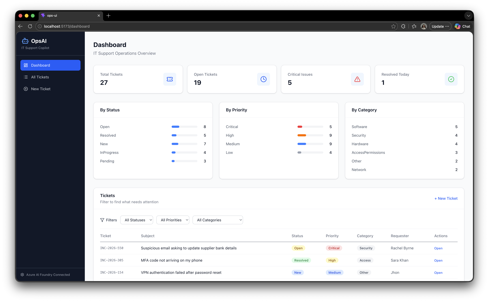

# OpsAI — AI-Powered IT Support Copilot

An enterprise IT support ticketing system with AI-powered triage, knowledge retrieval, and resolution assistance. Built with .NET 10, React TypeScript, and Azure AI services.

## Architecture

| Layer | Technology |
|-------|-----------|
| Frontend | React 19 + TypeScript + Vite + Tailwind CSS |
| Backend | .NET 10 Web API |
| Database | Azure Cosmos DB (NoSQL) |
| AI | Azure OpenAI (GPT-4o) + Azure AI Search |

---



## Application Workflow

The complete end-to-end workflow from ticket submission to resolution, showing how each feature maps to Azure AI services:

```
┌─────────────────────────────────────────────────────────────────────────────────┐
│                           OpsAI APPLICATION WORKFLOW                             │
└─────────────────────────────────────────────────────────────────────────────────┘

 ┌──────────┐        ┌──────────────┐        ┌──────────────┐        ┌──────────┐
 │  TICKET  │──────▶ │  AI TRIAGE   │──────▶ │  RESOLUTION  │──────▶ │ RESOLVED │
 │  INTAKE  │        │   RESULT     │        │  WORKSPACE   │        │ SUMMARY  │
 └──────────┘        └──────────────┘        └──────────────┘        └──────────┘
      │                     │                       │                       │
      ▼                     ▼                       ▼                       ▼
 ┌──────────┐        ┌──────────────┐        ┌──────────────┐        ┌──────────┐
 │  Cosmos  │        │ Azure OpenAI │        │ Azure AI     │        │  Cosmos  │
 │    DB    │        │ + AI Search  │        │ Search +     │        │    DB    │
 │          │        │ + AI Foundry │        │ OpenAI       │        │          │
 └──────────┘        └──────────────┘        └──────────────┘        └──────────┘
```

### Service-to-Feature Matrix

| Feature | Azure OpenAI | Azure AI Search | Azure AI Foundry | Cosmos DB |
|---------|:---:|:---:|:---:|:---:|
| Dashboard Stats | | | | ✅ |
| Ticket CRUD | | | | ✅ |
| Priority Classification | ✅ | | ✅ | |
| Category Detection | ✅ | | ✅ | |
| Sentiment Analysis | ✅ | | ✅ | |
| Key Phrase Extraction | ✅ | | | |
| Assignee Suggestion | ✅ | | | |
| KB Article Matching | | ✅ | ✅ | |
| KB Semantic Search | | ✅ | | |
| Resolution Steps | ✅ | ✅ | ✅ | |
| Response Drafting | ✅ | | ✅ | |
| Satisfaction Prediction | ✅ | | | |
| Escalation Workflow | | | ✅ | ✅ |
| Audit Trail | | | | ✅ |

---

## Data Flow Diagram

```
User (Browser)
     │
     ▼
┌─────────────┐     ┌──────────────────────────────────────────────┐
│  React SPA  │────▶│              .NET 10 Web API                 │
│  (Vite)     │◀────│                                              │
│             │     │  ┌────────────┐  ┌─────────────────────────┐ │
│  Pages:     │     │  │ Controllers│  │      Services           │ │
│  • Dashboard│     │  │            │  │                         │ │
│  • Intake   │     │  │ • Tickets  │  │ • IAiTriageService      │ │
│  • Triage   │     │  │ • AI       │──▶│ • IAiResolutionService  │ │
│  • Workspace│     │  │ • Knowledge│  │ • IKnowledgeSearchSvc   │ │
│  • Summary  │     │  │ • Audit    │  │                         │ │
│             │     │  └────────────┘  └───────────┬─────────────┘ │
└─────────────┘     │                              │               │
                    │                              ▼               │
                    │  ┌───────────────────────────────────────┐   │
                    │  │           Azure Services              │   │
                    │  │                                       │   │
                    │  │  ┌─────────┐ ┌────────┐ ┌─────────┐  │   │
                    │  │  │ OpenAI  │ │Search  │ │Cosmos DB│  │   │
                    │  │  │ GPT-4o  │ │        │ │         │  │   │
                    │  │  └─────────┘ └────────┘ └─────────┘  │   │
                    │  └───────────────────────────────────────┘   │
                    └──────────────────────────────────────────────┘
```

---

## Getting Started

### Prerequisites
- .NET 10 SDK
- Node.js 20+
- Azure Cosmos DB Emulator (or Azure Cosmos DB account)

### Backend

```bash
cd OpsAI.Api
# Update CosmosDb connection string in appsettings.json if needed
dotnet run
```

API runs at `http://localhost:5150`

### Frontend

```bash
cd ops-ui
npm install
npm run dev
```

UI runs at `http://localhost:5173` (proxies API calls to backend)

---

## API Endpoints

### Tickets
- `GET /api/tickets` — List tickets (with filtering/pagination)
- `GET /api/tickets/{id}` — Get ticket detail
- `POST /api/tickets` — Create ticket
- `PUT /api/tickets/{id}` — Update ticket
- `DELETE /api/tickets/{id}` — Delete ticket
- `GET /api/tickets/stats` — Dashboard statistics

### AI
- `POST /api/ai/triage/{ticketId}` — Run AI triage on a ticket
- `GET /api/ai/triage/{ticketId}` — Get existing triage result
- `POST /api/ai/suggest-resolution/{ticketId}` — Get AI troubleshooting steps
- `POST /api/ai/draft-response/{ticketId}` — Generate customer response
- `POST /api/ai/escalate/{ticketId}` — Escalate ticket to senior support
- `POST /api/ai/resolve/{ticketId}` — Mark ticket resolved with summary

### Knowledge Base
- `GET /api/knowledge` — List all articles
- `GET /api/knowledge/{id}` — Get article by ID
- `GET /api/knowledge/search?q=term` — Semantic search over articles

### Audit
- `GET /api/audit/{ticketId}` — Get full audit trail for a ticket

---

## Seed Data

The app seeds on first run with:
- **23 realistic IT tickets** — VPN issues, password resets, phishing reports, hardware failures, access requests, software installs, network outages, security incidents
- **15 knowledge base articles** — Password reset guide, VPN troubleshooting, MFA setup, Outlook fixes, printer guide, WiFi issues, software requests, onboarding checklist, BitLocker recovery, shared drives, phishing response, docking stations, meeting rooms, battery optimization, Azure DevOps access
- **14 audit trail entries** — Ticket creation, AI triage events, status changes, escalations, resolutions

---

## Azure AI Integration

### Current State: ✅ LIVE with Azure AI Services

The application is **connected to real Azure AI services** via Azure AI Foundry. AI features are powered by GPT-4o with intelligent fallback to rule-based classification if the service is unavailable.

| Interface | Live Implementation | Fallback | Azure Service |
|-----------|-------------------|----------|---------------|
| `IAiTriageService` | `AzureOpenAiTriageService` | `MockAiTriageService` | Azure OpenAI (GPT-4o) |
| `IAiResolutionService` | `AzureOpenAiResolutionService` | `MockAiResolutionService` | Azure OpenAI (GPT-4o) |
| `IKnowledgeSearchService` | `AzureAiSearchService` | Cosmos DB text search | Azure AI Search |

### How It Works

```
┌─────────────────────────────────────────────────────────────────────┐
│                   LIVE AZURE AI PIPELINE                             │
├─────────────────────────────────────────────────────────────────────┤
│                                                                     │
│  User submits ticket                                                │
│       │                                                             │
│       ▼                                                             │
│  ┌─────────────────────────────────────────────────────────────┐    │
│  │ AzureOpenAiTriageService                                    │    │
│  │                                                             │    │
│  │  1. Builds system prompt with classification instructions   │    │
│  │  2. Sends ticket subject + description to GPT-4o            │    │
│  │  3. GPT-4o returns structured JSON:                         │    │
│  │     • Priority (Low/Medium/High/Critical)                   │    │
│  │     • Category (VPN/Security/Network/etc.)                  │    │
│  │     • Sentiment (Positive/Neutral/Frustrated/Urgent)        │    │
│  │     • Confidence score (0.0 - 1.0)                          │    │
│  │     • Reasoning explanation                                 │    │
│  │     • Suggested assignee                                    │    │
│  │     • Key phrases extracted                                 │    │
│  │  4. Queries Cosmos DB for matching KB articles              │    │
│  │  5. Returns complete TriageResult                           │    │
│  │                                                             │    │
│  │  ⚠️ On failure: Falls back to MockAiTriageService           │    │
│  └─────────────────────────────────────────────────────────────┘    │
│       │                                                             │
│       ▼                                                             │
│  ┌─────────────────────────────────────────────────────────────┐    │
│  │ AzureOpenAiResolutionService                                │    │
│  │                                                             │    │
│  │  Suggest Resolution:                                        │    │
│  │  • Sends ticket + matched KB articles as context to GPT-4o  │    │
│  │  • GPT-4o generates 4-7 actionable troubleshooting steps    │    │
│  │  • Steps are grounded in KB content (RAG pattern)           │    │
│  │                                                             │    │
│  │  Draft Response:                                            │    │
│  │  • Takes ticket + resolution steps as input                 │    │
│  │  • GPT-4o composes professional customer-facing email       │    │
│  │  • Includes empathetic tone + estimated resolution time     │    │
│  │                                                             │    │
│  │  Satisfaction Prediction:                                   │    │
│  │  • Analyzes ticket priority, time open, resolution quality  │    │
│  │  • Returns predicted CSAT score (0.0 - 1.0)                 │    │
│  └─────────────────────────────────────────────────────────────┘    │
│       │                                                             │
│       ▼                                                             │
│  ┌─────────────────────────────────────────────────────────────┐    │
│  │ AzureAiSearchService                                        │    │
│  │                                                             │    │
│  │  • Attempts semantic search via Azure AI Search index       │    │
│  │  • If index not available, falls back to Cosmos DB          │    │
│  │    CONTAINS() text search over KB articles                  │    │
│  │  • Returns ranked articles by relevance/helpfulness         │    │
│  └─────────────────────────────────────────────────────────────┘    │
│                                                                     │
└─────────────────────────────────────────────────────────────────────┘
```

### Configuration (`appsettings.json`)

```json
{
  "CosmosDb": {
    "ConnectionString": "AccountEndpoint=https://your-account.documents.azure.com:443/;AccountKey=...",
    "DatabaseName": "OpsAI"
  },
  "AzureOpenAI": {
    "Endpoint": "https://your-foundry.services.ai.azure.com",
    "ApiKey": "your-api-key",
    "DeploymentName": "gpt-4o"
  },
  "AzureAISearch": {
    "Endpoint": "https://your-search.search.windows.net",
    "ApiKey": "your-api-key",
    "IndexName": "kb-index"
  }
}
```

> **Note**: For AI Foundry endpoints, use the base service URL (e.g., `https://name.services.ai.azure.com`) — do NOT include `/api/projects/...` path. The SDK handles routing internally.

> **Azure AI Search**: The `kb-index` must have a **semantic configuration** named `"default"` configured in the Azure portal. Set the title field to `title`, content field to `content`, and keyword field to `tags`. Without this, semantic search queries will fail.

### Automatic Fallback Behavior

The application is designed with **graceful degradation**:

```
Azure OpenAI available?
  ├── YES → Use GPT-4o for triage, resolution, drafting
  └── NO  → Fall back to rule-based classification (MockAiTriageService)
             - Keyword matching for category/priority
             - Template-based resolution steps
             - Pre-built response templates

Azure AI Search available?
  ├── YES → Semantic search with vector embeddings
  └── NO  → Cosmos DB CONTAINS() text search over KB articles
```

This means the app **never breaks** — it always returns results, just with varying intelligence levels.

### Service Registration Logic (`Program.cs`)

```csharp
// If Azure OpenAI credentials are configured → use real AI
if (!string.IsNullOrEmpty(openAiEndpoint) && !string.IsNullOrEmpty(openAiKey))
{
    var azureOpenAiClient = new AzureOpenAIClient(endpoint, credential);
    var chatClient = azureOpenAiClient.GetChatClient("gpt-4o");

    builder.Services.AddSingleton<IAiTriageService, AzureOpenAiTriageService>();
    builder.Services.AddSingleton<IAiResolutionService, AzureOpenAiResolutionService>();
}
else
{
    // No credentials → use mock (rule-based) implementations
    builder.Services.AddSingleton<IAiTriageService, MockAiTriageService>();
    builder.Services.AddSingleton<IAiResolutionService, MockAiResolutionService>();
}

// AI Search always uses AzureAiSearchService (has internal Cosmos DB fallback)
builder.Services.AddSingleton<IKnowledgeSearchService, AzureAiSearchService>();
```

---

## Project Structure

```
OpsAI/
├── OpsAI.Api/                    # .NET 10 Backend
│   ├── Controllers/
│   │   ├── TicketsController.cs  # CRUD + stats
│   │   ├── AiController.cs       # Triage, resolution, escalation
│   │   ├── KnowledgeController.cs # KB search
│   │   └── AuditController.cs    # Audit trail
│   ├── Services/
│   │   ├── Interfaces.cs         # IAiTriageService, IAiResolutionService, IKnowledgeSearchService
│   │   ├── AzureOpenAiTriageService.cs      # ✅ LIVE - GPT-4o classification
│   │   ├── AzureOpenAiResolutionService.cs  # ✅ LIVE - GPT-4o resolution/drafting
│   │   ├── AzureAiSearchService.cs          # ✅ LIVE - Semantic KB search
│   │   ├── MockAiTriageService.cs           # Fallback - rule-based classification
│   │   ├── MockAiResolutionService.cs       # Fallback - template responses
│   │   └── MockKnowledgeSearchService.cs    # Fallback - Cosmos text search
│   ├── Models/
│   │   ├── Ticket.cs
│   │   ├── KnowledgeArticle.cs
│   │   ├── TriageResult.cs
│   │   ├── Resolution.cs
│   │   ├── AuditEntry.cs
│   │   ├── Enums.cs
│   │   └── Dto/Requests.cs
│   ├── Data/
│   │   ├── CosmosDbService.cs    # Repository layer
│   │   └── SeedData.cs           # 23 tickets + 15 articles + 14 audits
│   ├── Program.cs                # DI, Cosmos init, Azure AI setup, middleware
│   └── appsettings.json          # Config (Cosmos, OpenAI, AI Search)
│
├── ops-ui/                       # React Frontend
│   ├── src/
│   │   ├── pages/
│   │   │   ├── Dashboard.tsx
│   │   │   ├── TicketIntake.tsx
│   │   │   ├── TriageResultPage.tsx
│   │   │   ├── ResolutionWorkspace.tsx
│   │   │   └── ResolutionSummary.tsx
│   │   ├── components/
│   │   │   ├── Layout.tsx        # Sidebar + shell
│   │   │   ├── Badge.tsx         # Priority/Status/Category badges
│   │   │   └── Card.tsx          # Card + StatCard
│   │   ├── services/api.ts       # Axios API client
│   │   ├── types/index.ts        # TypeScript interfaces
│   │   ├── App.tsx               # Router
│   │   └── main.tsx              # Entry point
│   └── vite.config.ts            # Vite + Tailwind + API proxy
│
├── README.md
└── .gitignore
```
